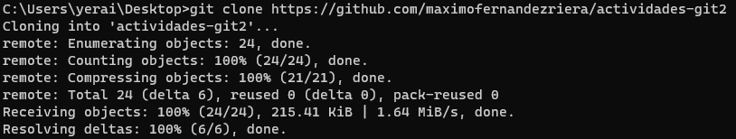
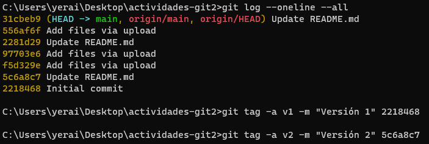
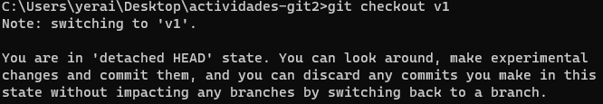
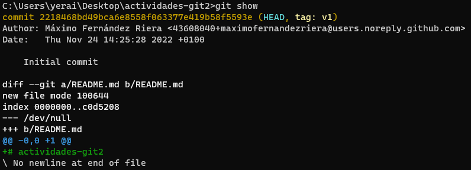
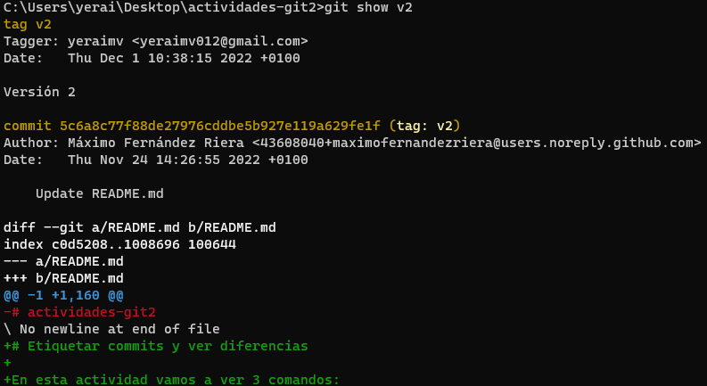
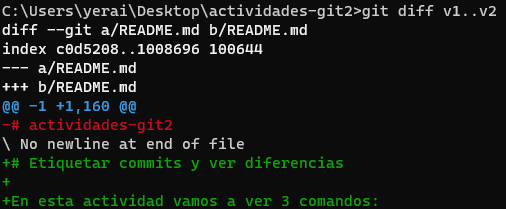
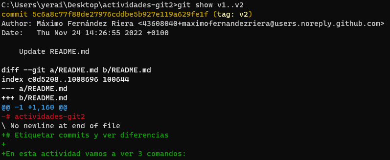

# actividades-git 2
Antes de comenzar con la actividad, clonaré el repositorio de la actividad con el siguiente comando:

## Primer log y asignar etiquetas a los 2 primeros commits
En este paso, escribiré los siguientes comandos para ver todos los commits realizados (log) y asignar etiquetas a los 2 primeros commits:

## Checkout
Ahora realizaré un checkout para colocarme en la versión del primer commit:

## Show
Con el siguiente comando, comprobaré que me encuentro en el commit inicial

Como se puede ver en la imagen, el único cambio añadido es "# actividades-git2". Los añadidos se diferencian con un "+".

Ahora mostraré el segundo commit para ver los cambios entre el primero y el segundo:

Como podemos comprobar, se eliminó la línea de texto del primer commit y se añadió más texto.

## Git diff vs. Git show
Ahora realizaré comandos de diff y de show, para ver los cambios entre commits y mostrar las diferencias entre estos comandos.

Primero haré el diff:

Ahora el show:

Como podemos comprobar, "diff" es más genérico y muestra directamente los cambios realizados entre el primer commit y el segundo, mientras que "show" lo que hace es mostrar los cambios que el segundo commit ha realizado, además de su hash, su autor, la fecha y el nombre del commit.

Ambos sirven para ver las diferencias entre commits, pero según he visto en foros, los programadores suelen preferir diff al ser más genérico y no tan específico y dependiente de un commit concreto.